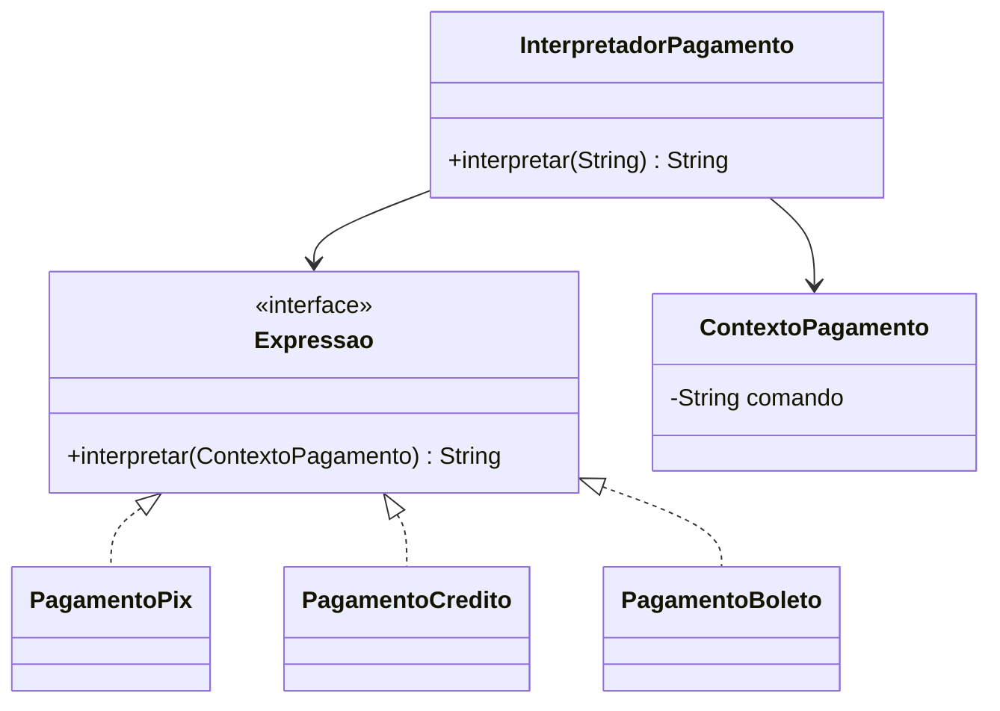

# Sistema de Pagamento — Padrão Interpreter

## Descrição

Projeto desenvolvido em **Java** utilizando o padrão de projeto **Interpreter** para interpretar comandos de pagamento.

O sistema recebe comandos em formato textual e identifica automaticamente o método de pagamento correspondente.

Exemplos:

```text
PAGAR PIX
PAGAR CREDITO
PAGAR BOLETO
```

Saídas:

```text
Pagamento realizado via PIX
Pagamento realizado via Cartão de Crédito
Pagamento realizado via Boleto
```

---

# Objetivo do Padrão Interpreter

O padrão **Interpreter** permite representar regras ou comandos através de classes que interpretam expressões.

Neste projeto:

- Cada forma de pagamento representa uma expressão;
- O interpretador central identifica qual expressão executar;
- O contexto armazena o comando recebido.

---

# Estrutura do Projeto

```plaintext
sistema-pagamento-interpreter/

src
├── main
│   └── java
│       └── br
│           └── com
│               └── pagamento
│                   ├── Main.java
│                   └── interpreter
│                       ├── Expressao.java
│                       ├── ContextoPagamento.java
│                       ├── PagamentoPix.java
│                       ├── PagamentoCredito.java
│                       ├── PagamentoBoleto.java
│                       └── InterpretadorPagamento.java

src
└── test
    └── java
        └── test
            └── br
                └── com
                    └── pagamento
                        └── interpreter
                            ├── PagamentoPixTest.java
                            ├── PagamentoCreditoTest.java
                            ├── PagamentoBoletoTest.java
                            └── InterpretadorPagamentoTest.java
```

---

# Diagrama de Classes



---

# Como Executar

## Executar aplicação

Execute a classe:

```text
Main.java
```

Saída esperada:

```text
Pagamento realizado via PIX
Pagamento realizado via Cartão de Crédito
Pagamento realizado via Boleto
```

---

# Executar Testes

Via Maven:

```bash
mvn test
```

Ou pelo IntelliJ:

```text
Run → Run Tests
```

---

# Casos de Teste

| Classe | Cenário |
|--------|---------|
| PagamentoPixTest | Deve interpretar pagamento PIX |
| PagamentoCreditoTest | Deve interpretar pagamento crédito |
| PagamentoBoletoTest | Deve interpretar pagamento boleto |
| InterpretadorPagamentoTest | Deve retornar pagamento inválido |

---

# Tecnologias

- Java
- Maven
- JUnit 5
- Padrão de Projeto Interpreter

---

# Autor

Projeto acadêmico desenvolvido para demonstrar a aplicação do padrão **Interpreter** em um sistema de pagamentos.
